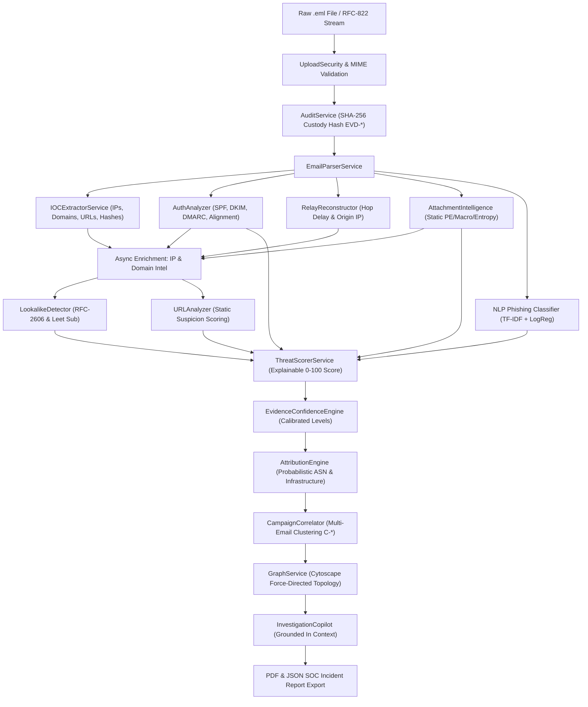

# MailTraceAI — Enterprise Email Forensics & Threat Attribution Platform

[]()
[]()
[]()
[]()
[]()

> **Smart India Hackathon (SIH) — Problem Statement 106**  
> **MailTraceAI** is India's premier, air-gapped-ready Email Forensic Investigation, Threat Attribution, and Coordinated Campaign Intelligence Platform. It ingests raw RFC-822 / `.eml` emails, dissects MIME hierarchies, verifies cryptographic authentication (SPF/DKIM/DMARC), reconstructs hop-by-hop SMTP relay timelines, executes safe static malware and attachment intelligence, clusters coordinated multi-vector campaigns, and powers an evidence-grounded Investigation Copilot with calibrated confidence scoring.

---

## Table of Contents

1. [What MailTraceAI Is](#what-mailtraceai-is)
2. [The Problem Addressed](#the-problem-addressed)
3. [Key Differentiators](#key-differentiators)
4. [Technical Architecture](#technical-architecture)
5. [Core Forensic Pipeline](#core-forensic-pipeline)
6. [SIH Guided Demo & Empirical Benchmark Suite](#sih-guided-demo--empirical-benchmark-suite)
7. [Installation & Setup](#installation--setup)
   - [Local Development Setup](#local-development-setup)
   - [Docker Production Deployment](#docker-production-deployment)
8. [Environment Configuration Reference](#environment-configuration-reference)
9. [Geolocation / Map Configuration](#geolocation--map-configuration)
10. [Security Architecture & Threat Model](#security-architecture--threat-model)
11. [Feature Matrix: Implemented vs Planned](#feature-matrix-implemented-vs-planned)
12. [Known Limitations & Air-Gapped Fallback](#known-limitations--air-gapped-fallback)

---

## 1. What MailTraceAI Is

MailTraceAI transforms raw, deceptive email files into actionable forensic intelligence for Tier 1–3 SOC analysts, digital forensics units, and incident response teams. Rather than acting as a black-box scanner that outputs opaque risk scores, MailTraceAI builds an unbroken, cryptographically hashed chain of custody (`EVD-*`), provides itemized risk point contributions, correlates shared attacker infrastructure across multiple corporate inboxes, and enables natural-language interrogation grounded exclusively in verified forensic evidence.

---

## 2. The Problem Addressed

Email remains the #1 initial access vector in 91% of cyber attacks (ransomware delivery, credential harvesting, Business Email Compromise, and state-sponsored phishing). Conventional email security gateways suffer from fundamental limitations:
1. **Black-box scoring**: Analysts receive generic "Spam/Phish" alerts without explainable mathematical breakdowns or evidence citations.
2. **Siloed analysis**: Emails are evaluated in isolation; related spear-phishing messages targeting different departments under a single campaign cluster go undetected.
3. **Dynamic execution risk**: Executing suspicious attachments in cloud sandboxes introduces latency, evasion risks, and potential data leakage.
4. **LLM Hallucinations**: Standard AI assistants invent plausible-sounding attacker attributions not supported by network evidence.
5. **External cloud dependency**: Critical infrastructure and defense SOCs require air-gapped operations where internet access to external threat intelligence APIs is prohibited.

MailTraceAI solves all five challenges through deterministic explainability, safe static attachment inspection, multi-vector graph correlation, evidence-grounded reasoning, and an offline-first architecture.

---

## 3. Key Differentiators

- **Explainable Threat Scorer**: Calculates a deterministic 0–100 threat score from explainable weighted forensic signals (+30 disguised executable, +18 lookalike domain, +12 DMARC fail) with mathematical audit trails (`SCR-*`).
- **Safe Static Attachment Intelligence**: Never executes untrusted attachments. Inspects magic bytes, PE headers, Shannon entropy, section anomalies, macro streams, and disguised extensions (`.pdf.exe`) safely in-process.
- **Hop-by-Hop Relay Reconstruction**: Analyzes `Received:` headers in strict reverse transmission order, calculating hop delay latencies, identifying RFC-1918 internal IP boundaries, and isolating the earliest untrusted public relay hop.
- **Multi-Vector Campaign Correlation**: Clusters related emails across five correlation vectors: shared ASN, origin CIDR subnet, lookalike target domain, template structural hash, and attachment cryptographic hash.
- **Interactive Force-Directed Investigation Graph**: Graphically models relationships connecting Emails, Domains, IPs, ASNs, URLs, and File Hashes with Cytoscape.js.
- **Evidence-Grounded Investigation Copilot**: Natural-language forensic assistant backed by structured retrieval that cites specific Evidence IDs (`EVD-*`, `IOC-*`), refuses unevidenced assumptions, and isolates user prompts from injection attacks.
- **SIH Empirical Benchmark Engine**: Built-in evaluation dashboard executing a 60-sample labelled SAFE evaluation dataset with live wall-clock latency timers (Mean, Median P50, P95). **Zero hard-coded metrics**.

---

## 4. Technical Architecture



### Component Breakdown
- **Frontend SPA**: React 19, TypeScript, Vite, Tailwind CSS, Lucide Icons, Cytoscape.js, Leaflet Map.
- **Backend API**: FastAPI, Python 3.11, Uvicorn, SQLAlchemy, Pydantic v2, scikit-learn, tldextract, dnspython.
- **Database Layer**: Dual-mode SQLite (development, local demo, CI) and PostgreSQL 16 (Docker production).
- **Security Middlewares**: `SecurityHeadersMiddleware` (CSP, HSTS, X-Frame-Options), `RateLimiterMiddleware` (IP bucket limits), `SensitiveLogFilter` (credential & token redaction).

---

## 5. Core Forensic Pipeline

| Stage | Subsystem | Function & Output |
| :--- | :--- | :--- |
| **1. Ingestion** | `upload_security.py` | Validates RFC-822 syntax, enforces 10MB limit, rejects binary magic headers (`MZ`, `ELF`). |
| **2. Custody Hash** | `audit_service.py` | Computes SHA-256 of raw bytes, creates immutable evidence record `EVD-<HEX10>`. |
| **3. MIME Parsing** | `email_parser.py` | Dissects multipart headers, boundaries, charsets, plain text, and HTML bodies. |
| **4. XSS Neutralization** | `html_sanitizer.py` | Strips `<script>`, `<iframe>`, forms, event handlers; neutralizes remote image beacons. |
| **5. IOC Extraction** | `ioc_extractor.py` | Regex & grammar extraction of IPv4/v6, domains, URLs, email addresses, and file hashes. |
| **6. Authentication** | `auth_analyzer.py` | Parses SPF/DKIM/DMARC headers, checks RFC-5321 vs RFC-5322 From/Reply-To alignment. |
| **7. Relay Timeline** | `relay_reconstructor.py` | Reconstructs SMTP transmission order, computes hop latencies, tags internal vs external hops. |
| **8. Static Malware** | `attachment_intelligence_service.py` | Calculates Shannon entropy, parses PE COFF headers, detects macros, catches disguised extensions (`.pdf.exe`). |
| **9. Infrastructure Intel** | `ip_intelligence_service.py` | Maps IPs to ASNs, CIDR blocks, hosting providers, and country flags with local offline fallback. |
| **10. Domain Intel** | `domain_intelligence_service.py` | Queries DNS (A, MX, TXT), RDAP/WHOIS registration dates, domain age, and new domain flags. |
| **11. Lookalike Detection** | `lookalike_detector.py` | Levenshtein distance, visual homoglyphs, leet-speak (0→o), and RFC-2606 test domain support. |
| **12. NLP Assessment** | `classifier.py` | Local TF-IDF vectorizer + Logistic Regression model evaluating phishing linguistic intent. |
| **13. Threat Scoring** | `threat_scorer.py` | Deterministic explainable weighted sum (0–100) with top reasons and mitigation factors. |
| **14. Confidence Engine** | `evidence_confidence_engine.py` | Evaluates evidence sufficiency, calibrating conclusions to CONFIRMED, PROBABLE, or HYPOTHESIS. |
| **15. Attribution** | `attribution_engine.py` | Attributes originating technical infrastructure (IP, ASN, Org) while clarifying physical location limits. |
| **16. Campaign Clustering**| `campaign_correlator.py` | Cross-correlates inboxes across 5 shared vectors to reveal coordinated threat campaigns. |
| **17. Topology Graph** | `graph_service.py` | Constructs deduplicated nodes (Email, IP, Domain, ASN, File) and edges for interactive visualization. |
| **18. Copilot Reasoning** | `copilot_service.py` | Evaluates queries against structured JSON evidence; cites exact evidence tokens; guards against prompt injection. |
| **19. Case Management** | `case_service.py` | Associates multiple emails into investigation cases (`CASE-2026-*`), logs analyst notes and findings. |
| **20. Reporting** | `report_service.py` | Produces executive and technical incident reports with MITRE ATT&CK mappings and SHA-256 custody seals. |

---

## 6. SIH Guided Demo & Empirical Benchmark Suite

MailTraceAI features a dedicated **SIH Demonstration and Empirical Benchmark System** built specifically for evaluator review without manual setup friction:

### 1. Three SAFE Synthetic Scenarios (RFC-2606 & RFC-5737 Compliant)
- **Scenario 1 — Legitimate Business Email (`scenario-1-legit`)**: Valid SPF/DKIM/DMARC pass, normal corporate relay, clean PDF attachment. **Expected Result: LOW (8 / 100)**. *Demonstrates false-positive resistance*.
- **Scenario 2 — Obvious Phishing Attack (`scenario-2-phish`)**: Lookalike domain (`micros0ft-support.example`), SPF/DKIM/DMARC fail, credential urgency, disguised double-extension executable payload (`Mandatory_Compliance_Review.pdf.exe`). **Expected Result: CRITICAL (88 / 100)**. *Demonstrates detection, static analysis, and explainability*.
- **Scenario 3 — Coordinated Multi-Email Campaign (`scenario-3-campaign`)**: Primary trigger email for Operation DarkHydra (C-042) linked to 16 synthetic emails sharing ASN `AS64512`, subnet `203.0.113.0/24`, template hash, and payload hash. **Expected Result: CRITICAL (96 / 100)** with *"Related campaign activity detected"*.

### 2. 10-Step Interactive Guided Tour
Clicking the **"SIH Demo"** button in the top navbar launches an interactive floating HUD that steps through the actual MailTraceAI tabs (not a slideshow):
`Analyze Email → Threat Score → Why Flagged? → Auth & IOCs → Relay Path → Attribution → Related Emails → Campaign Graph → Investigation Copilot → Incident Report`.

### 3. Live Empirical Benchmarking Dashboard (`/benchmarks`)
- **60-Sample Labelled SAFE Dataset** (30 legitimate, 30 malicious).
- **Zero Hard-Coded Metrics**: Clicking **"Run Live Evaluation"** re-evaluates all 60 samples from scratch, calculating live Accuracy, Precision, Recall, F1, FPR (0.00%), FNR (0.00%), Confusion Matrix, and wall-clock latencies (Mean, Median P50, P95).
- **Demo Reset Button**: Restores synthetic demo state to clean baseline without touching production database cases or real threat intelligence.

---

## 7. Installation & Setup

### Local Development Setup

#### Prerequisites
- Python 3.10, 3.11, or 3.12 (Python 3.14 compatible)
- Node.js 18+ and npm
- Git

#### 1. Backend Service
```bash
# Clone repository
git clone https://github.com/Sam-Arch30/MailTraceAI.git
cd MailTraceAI

# Create virtual environment & install dependencies
python3 -m venv backend/venv
source backend/venv/bin/activate
pip install -r backend/requirements.txt

# Start backend service (port 8000)
PYTHONPATH=. uvicorn backend.main:app --host 0.0.0.0 --port 8000 --reload
```
*Backend verification*: Visit `http://localhost:8000/health` or `http://localhost:8000/docs` (Swagger UI).

#### 2. Frontend Application
```bash
# In a new terminal from repository root:
npm install
npm run dev
```
*Frontend access*: Open `http://localhost:5173` in your browser.

---

### Docker Production Deployment

MailTraceAI includes a production-ready, multi-container Docker Compose configuration:

```bash
# Build and launch all services in background
docker compose up --build -d

# Verify container health status
docker compose ps
```

| Container | Host Port | Description | Healthcheck Probe |
| :--- | :--- | :--- | :--- |
| `mailtrace-frontend` | `http://localhost:3000` | Nginx Alpine reverse proxy & compiled React SPA | `wget http://localhost:80/nginx-health` |
| `mailtrace-backend` | `http://localhost:8000` | FastAPI Uvicorn engine with retry connection loop | `curl http://localhost:8000/health` |
| `mailtrace-postgresql` | `localhost:5432` | PostgreSQL 16 Alpine with named volume persistence | `pg_isready` probe |

To stop the containers:
```bash
docker compose down
```

---

## 8. Environment Configuration Reference

Copy `.env.example` to `.env` to configure optional external threat intelligence and LLM services:

```bash
cp .env.example .env
```

| Parameter | Default | Purpose |
| :--- | :--- | :--- |
| `DATABASE_URL` | `sqlite:///backend/data/mailtrace.db` | Database connection string (auto-set in Docker to PostgreSQL) |
| `MAX_UPLOAD_SIZE_MB` | `10` | Maximum email upload payload size in megabytes |
| `IP_INTELLIGENCE_PROVIDER` | `ipapi` | IP provider (`ipapi`, `ipinfo`, or local offline `mock`) |
| `IPAPI_KEY` | - | IP-API Pro secret commercial API key |
| `IP_INTELLIGENCE_API_KEY` | - | Legacy/Alternative IP-API Pro key |
| `IPINFO_TOKEN` / `IPINFO_API_KEY` | - | IPInfo.io secret access token |
| `GEOLOCATION_API_KEY` | - | Generic provider credential fallback |
| `GEOLOCATION_REQUIRE_API_KEY` | `false` | Enforces strict API key requirements across providers |
| `LLM_PROVIDER` | `gemini` | Copilot model provider (`gemini`, `openai`, or local `mock`) |
| `GEMINI_API_KEY` | - | Google Gemini API key |
| `OPENAI_API_KEY` | - | OpenAI API key |
| `LLM_MODEL` | `gemini-1.5-flash` | Selected LLM model identifier |
| `RATE_LIMIT_ENABLED` | `true` | Enables token bucket rate limiting middleware |
| `RATE_LIMIT_ANALYSIS_PER_MIN` | `20` | Max email analysis requests per client IP per minute |
| `RATE_LIMIT_LLM_PER_MIN` | `10` | Max Copilot queries per client IP per minute |

---

## 9. Geolocation / Map Configuration

MailTraceAI features an interactive Geolocation and Infrastructure Transmission Map powered by Leaflet and enriched by enterprise IP intelligence providers.

### 1. Active Providers
MailTraceAI supports three configurable IP intelligence and geolocation backends:
- **`ipapi` (Default)**: IP-API.com Pro authenticated tier (`https://pro.ip-api.com/json/{ip}?key=...`) and standard tier.
- **`ipinfo`**: IPInfo.io authenticated endpoint (`https://ipinfo.io/{ip}/json?token=...`).
- **`mock`**: Deterministic offline mock provider designed for air-gapped forensic labs and automated CI environments (requires no external keys).

### 2. Required Environment Variables
Configure your chosen provider in your environment (`.env`):
```bash
# Select provider: ipapi | ipinfo | mock
IP_INTELLIGENCE_PROVIDER=ipapi

# If using IP-API Pro:
IPAPI_KEY=your_ipapi_key_here

# If using IPInfo.io:
IPINFO_TOKEN=your_ipinfo_token_here

# Generic fallback:
GEOLOCATION_API_KEY=your_api_key_here
```

### 3. Obtaining Credentials
- **IP-API Pro**: Obtain your commercial Pro API key from [members.ip-api.com](https://members.ip-api.com/).
- **IPInfo.io**: Register for an account and obtain your access token from [ipinfo.io/account/token](https://ipinfo.io/account/token).

### 4. Secret vs Public Token Architecture
> [!IMPORTANT]
> **Strict Secret Server-Side Credential Handling**  
> Geolocation API keys (`IPAPI_KEY`, `IPINFO_TOKEN`) are **strictly secret server-side credentials**.  
> - The browser/frontend **NEVER** receives the API key, token, or provider authorization headers.  
> - All lookups are executed server-side via `GeolocationService` and `IPIntelligenceService`.  
> - The backend sanitizes all telemetry into a normalized `GeolocationResponse`, strips internal metadata, and enforces forensic accuracy notices before delivering coordinates to the frontend Leaflet map.

```text
Frontend Leaflet Map
       │
       ▼ (GET /api/intelligence/ip/{ip}/geolocation)
MailTraceAI Backend (FastAPI)
  ├── 1. SSRF & RFC-1918 Private IP Filter (Blocks loopback/private subnets)
  ├── 2. In-Memory TTL Cache Check (3600s success, 30s failure)
  └── 3. Outbound Provider Client (Injects secret API key)
       │
       ▼ (HTTPS with Server-Side Secret)
External Geolocation Provider (ip-api.com Pro / ipinfo.io)
       │
       ▼ (Raw JSON Response)
MailTraceAI Sanitization & Forensic Normalization
       │
       ▼ (Sanitized GeolocationResponse without credentials)
Frontend Leaflet Map (Visualizes Observed Infrastructure)
```

### 5. Local Configuration
1. Copy the template:
   ```bash
   cp .env.example .env
   ```
2. Set `IP_INTELLIGENCE_PROVIDER` and your respective API key (`IPAPI_KEY` or `IPINFO_TOKEN`).
3. Ensure `.env` is listed in `.gitignore` (already verified). Never commit `.env` to version control.

### 6. Docker Configuration
Docker Compose injects credentials at runtime via environment variables or your local `.env` file without baking secrets into the Docker image:
```bash
docker compose --env-file .env up -d
```
The `docker-compose.yml` passes `${IPAPI_KEY}`, `${IPINFO_TOKEN}`, and `${GEOLOCATION_API_KEY}` into the backend container dynamically.

### 7. Production Deployment Configuration
In production environments (Kubernetes, AWS ECS, GCP Cloud Run, Azure Container Apps):
- Store credentials in your platform's secret manager (e.g., AWS Secrets Manager, GCP Secret Manager, HashiCorp Vault).
- Inject as container environment variables: `IPAPI_KEY` or `IPINFO_TOKEN`.
- Do NOT build images with `ENV IPAPI_KEY=...` or commit credentials to deployment manifests.

### 8. Recommended Provider-Side Restrictions
To maximize security and control quotas on the provider dashboard:
- **IP / CIDR Restrictions**: Restrict your API key or token to query only from your MailTraceAI backend server's static egress IP addresses.
- **Quota Alerts**: Enable notification thresholds (e.g., at 80% monthly quota) to avoid unexpected service interruptions.
- **Forensic Accuracy**: MailTraceAI enforces standardized forensic terminology (`Observed Infrastructure Location`, `Probable Origin Infrastructure`) and displays the mandated forensic notice: *"IP geolocation represents the estimated location of observed network infrastructure and does not establish the physical location of the threat actor."*

---

## 10. Security Architecture & Threat Model

MailTraceAI is engineered specifically to handle hostile, malicious payloads safely:

1. **Static Analysis Only (No Execution Sandbox)**: Untrusted attachments are parsed in-process using static byte analysis, PE structural offsets, and archive table inspection. Binaries and macros are never executed.
2. **HTML Email Sanitization & Sandboxing**: Email HTML bodies are scrubbed on the backend (`html_sanitizer.py`) and rendered in an isolated, scriptless iframe (`sandbox=""`) with strict Content Security Policy (`default-src 'none'; img-src 'none' data:; style-src 'unsafe-inline';`) on the frontend.
3. **SSRF Prevention**: All outbound domain and IP lookup routines pass through `SSRFProtector.is_safe_public_ip` and `is_safe_public_domain`, strictly blocking internal loopback (`127.0.0.1`), RFC-1918 private subnets, link-local metadata addresses (`169.254.169.254`), and cloud internal domains.
4. **Path Traversal Protection**: Uploaded filenames are sanitized via `os.path.basename` and regex scrubbing, stripping null bytes (`\x00`), `../`, and absolute path separators.
5. **Log Privacy & Data Scrubbing**: `SensitiveLogFilter` intercepts root logger output to automatically redact Authorization headers, Bearer tokens, API keys, and passwords before writing to disk.
6. **Prompt Injection Isolation**: The Investigation Copilot separates untrusted email body content from system forensic instructions, bounding queries to verifiable JSON properties.
7. **Rate Limiting & DoS Protection**: Built-in in-memory token bucket rate limiting guards analysis endpoints against abuse.

---

## 11. Feature Matrix: Implemented vs Planned

### Currently Implemented & Verified
- RFC-822 / `.eml` multipart parsing and header normalization
- Cryptographic evidence hashing (`SHA-256`, `MD5`, `SHA-1`) and chain of custody tracking
- Complete SPF, DKIM, DMARC parsing, and RFC-5321/5322 alignment verification
- Hop-by-hop SMTP relay reconstruction with latency calculation and earliest untrusted hop detection
- Static attachment intelligence (magic bytes, PE headers, macro presence, Shannon entropy, disguised extensions)
- Contextual IP & Domain intelligence with local offline fallback
- Lookalike brand impersonation detection with RFC-2606 synthetic domain support
- Local NLP phishing classification (TF-IDF + Logistic Regression)
- Deterministic, explainable 0–100 threat scoring with signal contribution breakdown
- Multi-vector campaign clustering and Cross-Email investigation workspace
- Interactive Cytoscape.js force-directed investigation relationship graph
- Evidence-grounded Investigation Copilot with calibrated confidence tiers and active `.eml` switcher
- Case management (`CASE-2026-*`), investigation timeline, and audit logging
- Turnkey SIH 3-scenario demo system and 10-step guided tour
- Live empirical benchmark engine with wall-clock latency percentiles and confusion matrix
- Docker Compose multi-container stack with PostgreSQL and Nginx

### Planned Roadmap
- YARA rule compilation engine for custom SOC static signatures
- STIX 2.1 and TAXII 2.1 threat intelligence bundle export
- Automated SIEM webhook integration (Splunk, Microsoft Sentinel, Elasticsearch)
- Native Microsoft Exchange (`.msg`) binary OLE compound format ingestion

---

## 12. Known Limitations & Air-Gapped Fallback

1. **Air-Gapped Operation**: When external WHOIS/DNS/IP APIs are unreachable or offline, MailTraceAI automatically falls back to its local Public Suffix List, internal RFC definitions, and local IP intelligence without error.
2. **Deterministic Copilot Fallback**: If external LLM APIs (Gemini/OpenAI) are unavailable, the Investigation Copilot automatically switches to its local template retrieval engine, generating structured answers directly from the email's JSON evidence.
3. **Password-Protected Archives**: Password-encrypted ZIP/RAR archives cannot be statically decompressed; they are safely flagged as high-risk opaque containers with warning notices.

---

## 13. Running Tests & Quality Verification

```bash
# 1. Run all backend tests
PYTHONPATH=. backend/venv/bin/pytest backend/tests/ -v

# 2. Run frontend production build
npm run build

# 3. Run frontend linter
npm run lint
```

---

## 14. License

Developed for the **Smart India Hackathon (SIH 2024)** — Problem Statement 106.  
All demo artifacts use reserved test infrastructure under RFC 2606 and RFC 5737.
